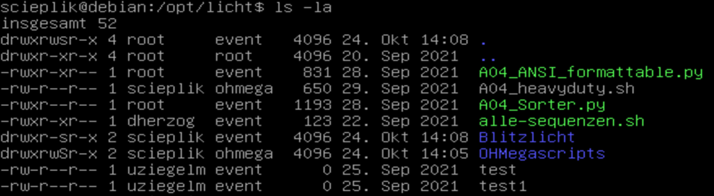
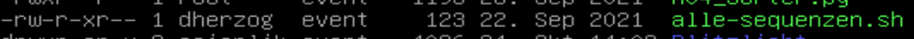
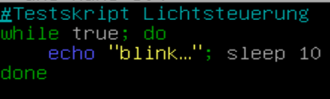

# EvP - Lernhilfe 1

---
| **Aktion**                           | **Befehl**                                                                                                                     |
|--------------------------------------|--------------------------------------------------------------------------------------------------------------------------------|
| **Rechte verändern**                 | `sudo chmod u/g/o +/-= rwx` oder `chmod 777` (r=4, w=2, x=1)                                                                   |
| **Gruppe verändern**                 | `sudo usermod -g Gruppe User` (Hauptgruppe ändern) oder `sudo usermod -ag Gruppe User` (weitere hinzufügen)                    |
| **Aus Gruppe löschen**               | `sudo gpasswd -d User Gruppe`                                                                                                  |
| **Gruppen eines Users anzeigen**     | `groups User` oder `id User`                                                                                                   |
| **Alle Gruppen anzeigen**            | `getent group`                                                                                                                 |
| **Gruppe erstellen**                 | `sudo groupadd Gruppenname` oder `sudo addgroup Gruppenname` (einfacher)                                                       |
| **Nutzer anlegen**                   | `sudo adduser Benutzer` oder `sudo useradd -m Benutzer` und danach `sudo passwd Benutzer`                                      |
| **Passwortoptionen**                 | `sudo passwd -e User` (Passwort ändern)  `sudo passwd -l User` (Konto sperren)  `sudo passwd -u User` (Konto entsperren) |
| **Rechte anzeigen**                  | `ls -l path`                                                                                                                   |
| **Besitzer einer Datei ändern**      | `sudo chown Besitzer:Gruppe Datei/Verzeichnis`                                                                                 |
| **Neue Dateien mit gleicher Gruppe** | `sudo chmod g+s Pfad`                                                                                                          |
| **Datei ausführen**                  | `bash Datei.sh` (geht immer), Shebang verwenden (`#!`), `chmod +x` setzen, dann `./Datei.sh` oder ganzer Pfad                  |
| **Verzeichnis erstellen**            | `mkdir Verzeichnis`                                                                                                            |
| **Remote kopieren**                  | `scp PfadZurDatei user@IPAdresse:Zielverzeichnis`                                                                              |
| **Kopieren**                         | `cp Quelle Ziel`                                                                                                               |

---
#### Beschreiben Sie möglichst detailliert, was der nachfolgende Befehl bewirkt.
`sudo adduser mschmitz`

Der Befehl `sudo adduser mschmitz` dient dazu, einen neuen Benutzer namens `mschmitz` zu erstellen.
Hierbei bekommt der ausführende temporär die Berechtigung diesen Admin Befehl mit `sudo` auszuführen.
`adduser` fügt einen Nutzer benutzerfreunbdlicher hinzu, da es so eine Art Setup beinhaltet.
`mschmitz` ist das benutze Argument für diesen Befehl.

---
#### Welcher Befehl fügt den Benutzer aus Aufgabe 1 der Gruppe `ohmega` hinzu?
Um den Benutzer `mschmitz` zur Gruppe `ohmega` hinzuzufügen wird der Befehl `sudo usermod -aG ohmega mschmitz`

---
#### Kann `dherzog` in den Ordner `Blitzlicht` wechseln? Begründen Sie!

`ALT: drwxrwsr-x 2 scieplik event 4096 24. Okt 14:08 Blitzlicht`

Ja, dherzog kann in den Ordner Blitzlicht wechseln, da er zur Gruppe event gehört und die 
Gruppenzugriffsrechte (einschließlich x) vorhanden sind.

---
#### Die Datei alle-sequenzen.sh soll im Ordner OHMegascripts vorhanden sein. Welche Möglichkeiten hat scieplik, um dies zu realisieren? Notieren Sie die Befehle und erläutern Sie die Unterschiede.
`mv alle-sequenzen.sh OHMegascripts/`  
mv (move): Verschiebt die Datei alle-sequenzen.sh in den Ordner OHMegascripts.

`cp alle-sequenzen.sh OHMegascripts/`  
cp (copy): Kopiert die Datei alle-sequenzen.sh in den Ordner OHMegascripts, wobei die Originaldatei im aktuellen Verzeichnis erhalten bleibt.

---
#### Kann dherzog die Datei alle-sequenzen.sh ausführen? 

`./alle-sequenzen.sh`  
Der Besitzer (dherzog) hat kein Ausführungsrecht für die Datei, auch wenn die Gruppenzugehörigkeit event das 
Ausführungsrecht hätte. Besitzerrechte haben Vorrang, und ohne das x-Bit für den Besitzer 
kann der Benutzer dherzog die Datei nicht ausführen.

---
#### Welche User-ID hat der Benutzer `qwertz`?
`cat /etc/passwd` nach user ID schauen, da je nach Anzahl der User diese ID anders sein kann.

---
#### Wie heißt der Benutzer mit der ID 0? Welche Bedeutung hat dieser Benutzer?
Das ist der root.

---
#### Was bewirkt die Abkürzung `man`?
Mit man können Benutzer Details zu einem Befehl nachschlagen, um dessen Funktion und alle 
möglichen Optionen zu verstehen. Dies ist besonders hilfreich, wenn man mit der genauen Syntax 
oder erweiterten Funktionen eines Befehls nicht vertraut ist.

---
#### Wofür steht das `-e` in `sudo passwd -e Benutzer`?
Es setzt das Passwort des Benutzers als abgelaufen.
Dadurch wird der Benutzer bei der nächsten Anmeldung dazu aufgefordert, ein neues Passwort einzugeben.

---
#### Darf ein Kunde Befehle mit sudo ausführen? 
Im Normalfall Nein.

---
#### Kann es passieren, dass alle Benutzer vom System ausgesperrt werden?
Ja, auch der root kann ausgesperrt werden.
