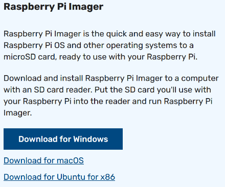
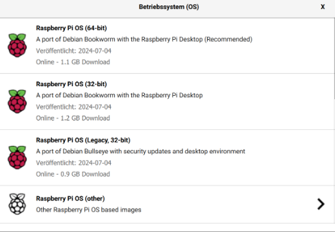
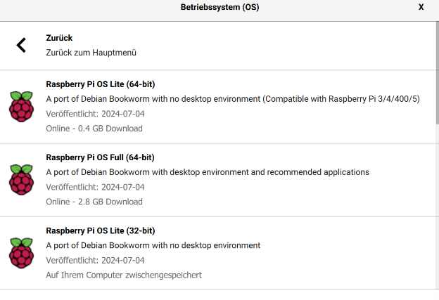
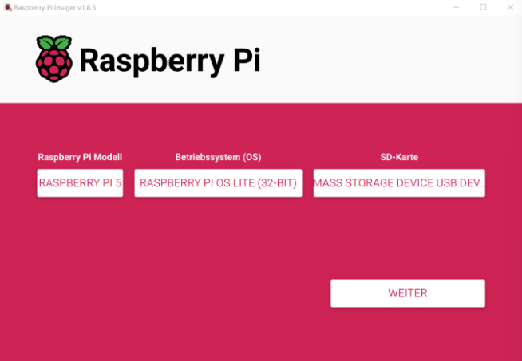
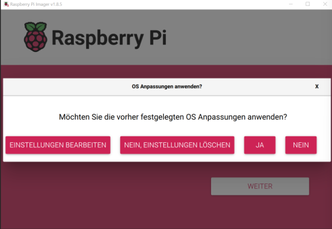
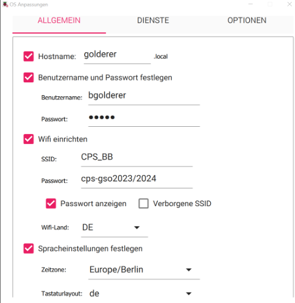
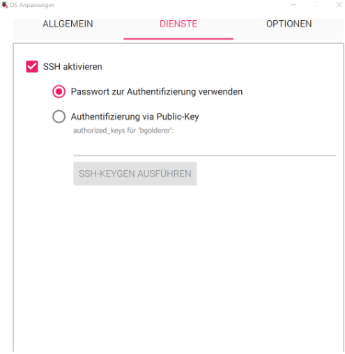
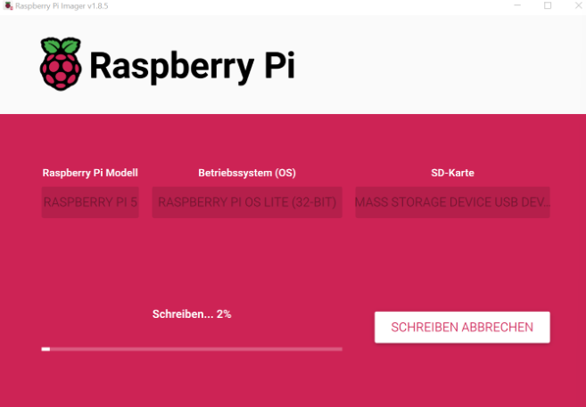

# Raspberry Pi Imager Anleitung

## 1. Raspberry Pi Imager herunterladen
Zuerst auf [https://www.raspberrypi.com/software/](https://www.raspberrypi.com/software/) für das eigene Betriebssystem den Raspberry Pi Imager downloaden und den Installationsprozess abschließen.

## 2. Raspberry Pi Imager öffnen
Öffne danach den Raspberry Pi Imager und wähle Raspberry Pi Modell, Betriebssystem und SD-Karte aus.

### Auswahl des Modells
Als Modell muss das jeweilige Raspberry Pi Modell ausgewählt werden.

### Auswahl des Betriebssystems
Als Betriebssystem wählen wir **Raspberry Pi OS Lite 32-bit**.

## 4. Einstellungen bearbeiten
Dann auf **weiter** klicken. In dem geöffneten Fenster **Einstellungen bearbeiten** auswählen.

## 5. Einstellungen vornehmen
Dort müssen die folgenden Einstellungen gemacht werden:

> ### Hostname
> Als Hostname soll der eigene Nachname kleingeschrieben verwendet werden.

> ### Benutzername
> Der Benutzername soll aus dem kleingeschriebenen ersten Buchstaben des Vornamens und dann dem Nachnamen bestehen.

> ### Passwort
> Das Passwort soll in der Gruppe das gleiche sein.

> ### WiFi
> - **SSID:** CPS_BB
> - **Passwort:** cps-gso2023/2024

> ### WiFi-Land
> Das WiFi-Land ist Deutschland.

> ### Tastaturlayout
> Das Tastaturlayout kann beliebig festgelegt werden.

## 6. SSH aktivieren
SSH soll aktiviert und ein Passwort zur Authentifizierung verwendet werden.

Danach auf **Speichern** klicken.

## 7. Einstellungen anwenden
Dann **Einstellungen anwenden** mit **Ja** beantworten und bestätigen, dass die vorhandenen Daten gelöscht werden.

## 8. Schreiben beginnen
Dann beginnt das Schreiben.

