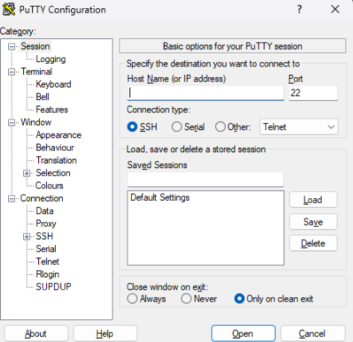
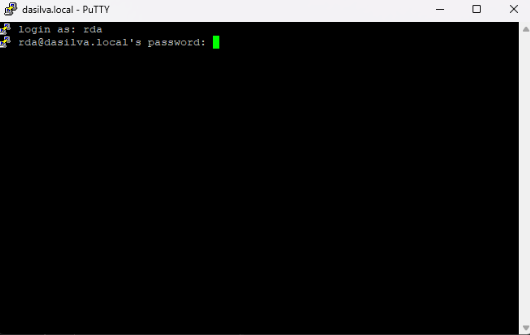
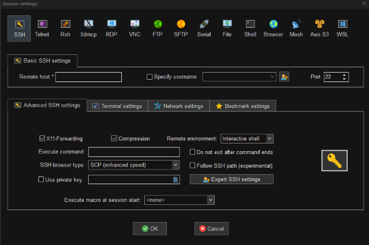

# Mit dem Raspberry Pi verbinden mittels SSH
## Inhaltsverzeichnis
1. [Über PuTTY](#über-putty)
2. [Über MobaXterm](#über-mobaxterm)

---
## Über PuTTY
Lade PuTTY von der offiziellen Website herunter und installiere es: [PuTTY Download](https://www.putty.org/#download).

Verwende den folgenden Befehl, um die IP-Adresse deines Raspberry Pi zu ermitteln:
``hostname -I``
Notiere die IP-Adresse deines Raspberry Pi.

Öffne PuTTY. Gib in das Feld **"Host Name (or IP address)"** die IP-Adresse des Raspberry Pi ein und setze den Port auf **22**.
Wähle den **Connection Type** SSH und klicke auf **Open**.

Wenn das Terminalfenster geöffnet wird, wirst du nach deinem Benutzernamen gefragt und anschließend nach deinem Passwort.

Wenn du alles korrekt eingegeben hast, bist du jetzt per SSH mit deinem Raspberry Pi verbunden.

---

## Über MobaXterm
Lade MobaXterm von der offiziellen Website herunter und installiere es: [MobaXterm Download](https://mobaxterm.mobatek.net/download-home-edition.html).

Verwende den folgenden Befehl, um die IP-Adresse deines Raspberry Pi zu ermitteln:
``hostname -I``
Notiere die IP-Adresse deines Raspberry Pi.

Öffne MobaXterm und klicke oben links auf **Session**.

Wähle **SSH** aus der Liste und gib die IP-Adresse deines Raspberry Pi und den Benutzernamen ein.
Wenn du den Standard-SSH-Port (**22**) verwendest, kannst du den so belassen. Klicke auf **OK**, um die Verbindung zu starten.

Nach dem Start wirst du nach dem Passwort gefragt. Nach erfolgreicher Anmeldung bist du per SSH mit deinem Raspberry Pi verbunden.
