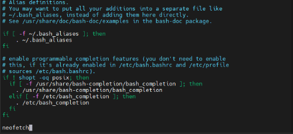

# Installieren von NeoFetch auf Debian-Systeme 

Bevor du mit der Installation beginnst, solltest du sicherstellen, dass dein System auf dem neuesten Stand ist. Öffne ein Terminal und führe folgende Befehle aus: 

```shell
sudo apt update
sudo apt upgrade 
```

  

Installiere Neofetch über die Paketverwaltung apt: 
```shell
sudo apt install neofetch -y 
```
  

Wenn alles richtig funktioniert, solltest du die Systeminformationen und das ASCII-Logo deines Betriebssystems sehen. Um Neofetch automatisch bei jedem Login auszuführen, musst du den entsprechenden Befehl in die Konfigurationsdatei für die Shell einfügen. 

  

Öffne die .bashrc-Datei im Home-Verzeichnis zur Bearbeitung: 
```shell
nano ~/.bashrc 
```
  

Füge am Ende der Datei den folgenden Befehl hinzu, um Neofetch automatisch auszuführen:	 
```shell
neofetch 
```


  

Speichere mit **CTRL+X** und bestätige mit **y**. 

  

Um die Änderungen zu übernehmen, kannst du entweder die Shell neu starten oder die .bashrc-Datei neu laden:		 
```shell
source ~/.bashrc 
```
  

 