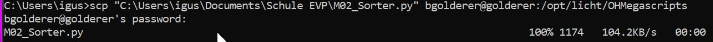
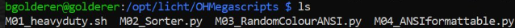

# Datentransfer mit dem Befehl SCP

---

## Inhaltsverzeichnis
- [Kurzerklärung](#kurzerklärung)
- [Transferieren von Dateien mit `scp`](#transferieren-von-dateien-mit-scp)

---

## Kurzerklärung
SCP (Secure Copy) ist ein Befehlszeilenprogramm, das es ermöglicht, Dateien und Verzeichnisse 
sicher zwischen zwei Standorten zu kopieren.

Beim Übertragen von Daten mit SCP werden sowohl die Dateien als auch das Passwort verschlüsselt, 
sodass niemand, der den Datenverkehr überwacht, an sensible Informationen gelangt. SCP nutzt das 
SSH-Protokoll für Authentifizierung und Verschlüsselung.

---

## Transferieren von Dateien mit ``scp``

Gib in deiner Windows Konsole den SCP-Befehl ein, um den Transfer zu starten. 
Damit dieser transfer stattfinden kann, wirst du nach einem Passwort gefragt.

```bash
# Syntax
scp "C:\Pfad\Zur\Datei" Benutzername@Ziel:Pfad/Zum/Verzeichnis

# Beispiel
scp "C:\Users\igus\Downloads\M02_Sorter.py" rda@rda:opt/licht/...
```
Sobald die Verbindung steht, legt SCP los und schiebt die Daten rüber.
Ob das nun eine einzelne Datei oder ein ganzes Verzeichnis ist. 
Die Übertragungsgeschwindigkeit kann variieren, je nachdem, wie groß die Datei ist und wie 
schnell die Internetverbindung gerade ist.



Ist der Transfer durch, sagt SCP einfach "Fertig!" und schließt die Verbindung automatisch.<br>
Danach lohnt es sich, kurz zu prüfen, ob die Dateien am Zielort angekommen und vollständig sind. 




