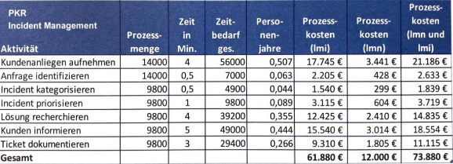

### Stellen Sie für eine Aktivität(z.B. „Kundenanliegen aufnehmen“)für jedeKennzahl (Spalten der Tabelle) dieBerechnung auf(kaufmännisch auf 2 Nachkommastellen runden)→Berechnungsformeln mit Zahlen laut Tabelle/Beispiel „füllen“.

- Prozessmengepro Jahr: 14.000Service-Anfragen
- Jahresarbeitslohnder Stelle: 35.000,00 EUR
- Jahresarbeitsminuten: (Annahme:) 230 Arbeitstage pro Jahr x 8 Arbeitsstunden proTag x 60 Minuten = 110.400 Minuten pro Mitarbeiter im Jahr
- lmn-Kosten: 12.000,00 EUR
- lmi-Kosten: Jeweilige Zeitangabe und Häufigkeiten der Tätigkeiten entnehmen Sie bitte der Tabelle:Sollte ich wissen:

> - Prozessmenge: Ist gegeben 
> - Zeit in Min.: Aus dem Diagramm ablesen
> - Zeitbedarf: 14000 · 4 = 56000
> - Personen im Jahr: 56000 / 110400 = 0,507
> - Prozesskosten (LMI): Personenbedarf * Jahresarbeitslohn
> - Prozesskosten (LMN): 100 * 12000 / Summe der LMI
> - Prozesskosten (LMI/LMN):

