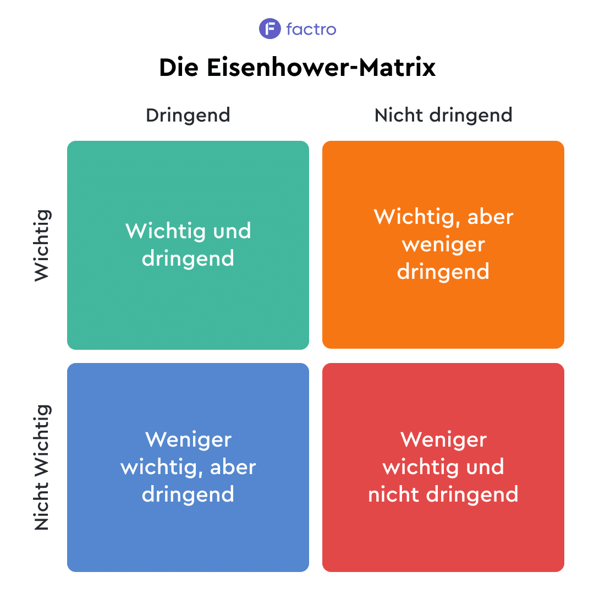

# GiD – Lernhilfe 1


# Service-Level-Agreement, Ticketsystem, Support-Level

---
> #### erläutern, was unter IT-Servicemanagement (ITSM) zu verstehen ist.
> IT-Servicemanagement (ITSM) ist ein Ansatz zur **Planung**, **Bereitstellung**, **Verwaltung** und **Verbesserung** von IT-Dienstleistungen in Unternehmen.
---
> #### erläutern, inwiefern Kundenzufriedenheit als primäres Ziel von ITSMzu verstehen ist.
> Die Fokussierung auf Kundenzufriedenheit dient zu einer stärkeren Kundenbindung, einem verbesserten Unternehmensruf und einer höheren Effizienz der IT-Abteilung.
---
>#### erläutern, was unter Information Technology Infrastructure Library(ITIL) zu verstehen ist und Vor-und Nachteile für die Nutzung von ITIL für Unternehmen benennen.
> Information Technology Infrastructure Library (ITIL) ist eine weltweit anerkannte Sammlung von Best Practices für das IT-Service-Management, das Unternehmen dabei unterstützt, ihre IT-Services effizient zu verwalten und zu verbessern.
> 
> | Vorteile                           | Nachteile                                           |
> |------------------------------------|-----------------------------------------------------|
> | Verbesserte IT-Services            | Komplexe und zeitaufwändige Implementierung         |
> | Kostenreduzierung                  | Möglicher Widerstand gegen Veränderungen            |
> | Erhöhte Kundenzufriedenheit        | Hohe Schulungskosten                                |
> | Besseres Risikomanagement          | Langfristiger Ansatz mit wenig kurzfristigem Nutzen |
> | Verbesserte Ressourcennutzung      | Potenzielle Störung bestehender Prozesse            |
> | Erhöhte Transparenz der IT-Kosten  | Umfangreicher Schulungsbedarf                       |
> | Flexiblere Serviceumgebung         | Lange Implementierungszeit                          |
> | Gemeinsame Sprache für IT-Prozesse | Mögliche Einschränkung der Kreativität              |
---
> #### einen Werkvertrag von einem Dienstvertrag abgrenzen und das Service-Level-Agreement einer dieser beiden Vertragsarten begründet zuordnen.
> Hier ist eine kürzere Version der Abgrenzung zwischen Werkvertrag und Dienstvertrag sowie der Zuordnung des Service-Level-Agreements (SLA):
> <br>**Werkvertrag vs. Dienstvertrag**
> - Werkvertrag:
>  - Ziel: Herstellung eines bestimmten Ergebnisses (z. B. Softwareentwicklung).
>  - Vergütung: Erfolgsabhängig.
> - Dienstvertrag:
>  - Ziel: Erbringung von Dienstleistungen (z. B. IT-Support).
>  - Vergütung: Für geleistete Arbeit, unabhängig vom Erfolg.
> 
> **Zuordnung des Service-Level-Agreements (SLA)**
> <br>Ein SLA gehört in der Regel zum Dienstvertrag, da es:
> - Dienstleistungsqualität definiert (z. B. Verfügbarkeit, Reaktionszeiten).
> - Kontinuierliche Leistungen regelt, nicht ein spezifisches Endprodukt.
> - Prozessfokus hat, anstatt ein konkretes Ergebnis zu garantieren.
> 
> ```
> SLAs sind charakteristisch für Dienstverträge, da sie die Qualität und den Umfang
> von Dienstleistungen festlegen.
> ```
---
> #### mindestens fünf Bestandteile (Parameter) eines Tickets benennen und erläutern, wieso dieses sinnvoll (oder notwendig) für die Beschreibung eines Tickets sind.
> | **Feld**                    | **Beschreibung**                                                | **Sinnvoll für**                                                   |
> |-----------------------------|-----------------------------------------------------------------|--------------------------------------------------------------------|
> | **Ticketnummer**            | Eindeutige ID für jedes Ticket.                                 | Präzise Zuordnung und Verfolgung jedes Vorfalls.                   |
> | **Status**                  | Aktueller Bearbeitungsstand (z.B. Neu, In Bearbeitung, Gelöst). | Schnellen Überblick über den Fortschritt.                          |
> | **Priorität**               | Dringlichkeit oder Wichtigkeit des Tickets.                     | Effektive Ressourcenzuweisung und Bearbeitung kritischer Probleme. |
> | **Zugewiesener Bearbeiter** | Verantwortlicher Mitarbeiter.                                   | Klare Verantwortlichkeiten und effiziente Bearbeitung.             |
> | **Beschreibung**            | Detaillierte Probleminformationen.                              | Verständnis des Problems und effektive Lösung.                     |
>
> Diese Parameter ermöglichen eine strukturierte, nachvollziehbare und effiziente Bearbeitung von Kundenanfragen oder technischen Problemen.
---
> #### erläutern, worum es sich bei einem Ticketsystem handelt.
> Ein Ticketsystem, hilft Unternehmen dabei, Kundenanfragen, Probleme oder Störungen zu erfassen 
> und zu verwalten. Es funktioniert wie eine Anlaufstelle, wo Nutzer ihre Anliegen einreichen können, 
> die dann in Form von Tickets bearbeitet werden.
---
> #### den Prozess der Ticket-Bearbeitung erläutern und in groben Zügen visualisieren.
> Der Prozess der Ticket-Bearbeitung
> 1. **Erfassung** ➔ Ein Ticket wird erstellt, entweder durch einen Nutzer oder automatisch.
> 2. **Kategorisierung** ➔ Das Ticket wird nach Thema und Dringlichkeit eingestuft.
> 3. **Zuweisung** ➔ Ein zuständiger Mitarbeiter wird dem Ticket zugeteilt.
> 4. **Bearbeitung** ➔ Der Mitarbeiter arbeitet an der Lösung des Problems.
> 5. **Kommunikation** ➔ Der Nutzer wird über den Fortschritt informiert.
> 6. **Abschluss** ➔ Das Problem wird gelöst und das Ticket geschlossen.
> 7. **Feedback** ➔ Optional kann der Nutzer eine Bewertung abgeben.
> ```
> [Erfassung] -> [Kategorisierung] -> [Zuweisung] -> [Bearbeitung]
>                                                         |
>                                                Ja       v
> [Feedback] <- [Abschluss] <- [Kommunikation] <----- [Lösung?]
>                                                        | 
>                                                        | Nein
>                                                        v
>                                               [Weitere Bearbeitung]
> ```
---
> #### die drei Support Level (1st, 2nd, 3rd) Support voneinander abgrenzen und beispielhafte Service-Anfragen/Probleme für diese drei Support-Level nennen.
> **First-Level-Support**
> <br>Erste Anlaufstelle für Kundenanfragen
> <br>Löst einfache, häufige Probleme
> <br><br>**Beispiele**:
> - Passwort zurücksetzen
> - Grundlegende Softwareprobleme beheben
> - Allgemeine Produktinformationen geben
> ---
> **Second-Level-Support**
> <br>Bearbeitet komplexere Probleme 
> <br>Tieferes technisches Wissen 
> <br><br>**Beispiele**:
> - Netzwerkprobleme diagnostizieren
> - Softwarekonfigurationen anpassen
> - Datenwiederherstellung
> ---
> **Third-Level-Support**
> <br>Höchste Eskalationsstufe
> <br>Experten für sehr komplexe Probleme
> <br><br>**Beispiele**:
> - Schwerwiegende Systemausfälle beheben
> - Sicherheitslücken analysieren und schließen
> - Produktentwicklung unterstützen
---
> #### erläutern, was es heißt, ein Ticket zu eskalieren und wie dies geschieht.
> Ein Ticket zu eskalieren bedeutet, es an eine höhere Supportebene weiterzuleiten, wenn das aktuelle Team das Problem nicht lösen kann. 
---
> #### erläutern, worum es sich bei einem Service-Level-Agreement handelt und mindestens fünf Vertragsbestandteile nennen.
> Ein Service-Level-Agreement (SLA) ist ein Vertrag zwischen einem Dienstleister und einem Kunden, 
> der die Qualität, den Umfang und die Bedingungen einer Dienstleistung festlegt. 
> Es definiert die Erwartungen und Verpflichtungen beider Parteien.
> - **Leistungsbeschreibung**<br>Detaillierte Auflistung der zu erbringenden Dienste.
> - **Servicezeiten** <br>Festlegung, wann der Service verfügbar sein muss.
> - **Reaktionszeiten** <br>Zeitrahmen, in dem der Dienstleister auf Anfragen oder Probleme reagieren muss.
> - **Verfügbarkeit** <br>Prozentsatz der Zeit, in der der Service funktionsfähig sein muss.
> - **Vertragsstrafen** <br>Konsequenzen bei Nichteinhaltung der vereinbarten Leistungen.
>
> Ein SLA schafft Transparenz, setzt klare Erwartungen und bietet beiden Parteien eine Grundlage für die Bewertung der Servicequalität.
---
> #### die Begriffe Servicezeit, Reaktionszeit, Entgegennahmezeit und Vororteinsatzzeit voneinander abgrenzen.
> - **Servicezeit**:
>  - Zeitraum, in dem der Support generell verfügbar ist
>  - Beispiel: Montag bis Freitag, 9:00 - 17:00 Uhr
> - **Reaktionszeit**:
>  - Zeit bis zur ersten Rückmeldung auf eine Anfrage
>  - Beginnt mit Eingang der Meldung
>  - Beispiel: Innerhalb von 2 Stunden nach Ticketerstellung
> - **Entgegennahmezeit**:
>  - Zeit bis ein Anruf oder eine Anfrage angenommen wird
>  - Meist für Telefon-Hotlines relevant
>  - Beispiel: 90% der Anrufe werden binnen 30 Sekunden angenommen
> - **Vororteinsatzzeit**:
>  - Zeit bis ein Techniker beim Kunden vor Ort eintrifft
>  - Gilt für Probleme, die Präsenz erfordern
>  - Beispiel: Techniker erscheint innerhalb von 4 Stunden
---
> #### erläutern, worum es sich bei Severity-Level handelt und die Relevanz dessen für die Bearbeitung von Service-Anfragen darstellen.
> Severity-Level sind Stufen, die den Schweregrad eines Problems oder einer Anfrage im IT-Support 
> beschreiben. Sie helfen dabei, Vorfälle zu priorisieren und die richtigen Ressourcen zuzuweisen.
> - Kritisch: Systemausfall, schwerwiegende Auswirkungen
> - Hoch: Wichtige Funktionen beeinträchtigt
> - Mittel: Eingeschränkte Funktionalität
> - Niedrig: Kleine Probleme, keine dringende Lösung nötig
> 
> Relevanz für die Bearbeitung von Service-Anfragen:
> - Priorisierung: Wichtige Probleme werden zuerst bearbeitet
> - Ressourcenzuweisung: Höhere Levels erhalten mehr Aufmerksamkeit
> - Reaktionszeiten: Definiert, wie schnell der Support reagieren muss
> - Eskalation: Bestimmt, wann ein Problem an höhere Support-Ebenen weitergeleitet wird
> 
> Severity-Level helfen, den Support effizient zu gestalten und sicherzustellen, dass kritische Probleme schnell gelöst werden.
---
> #### erläutern, worum es sich bei einem Change-Request handelt (und ein Beispiel nennen) und diesen von einem „einfachen“ Ticket/Service-Anfrage abgrenzen.
> Ein Change-Request ist eine Anfrage zur Änderung eines bestehenden Systems, 
> Prozesses oder Produkts. <br>Im Gegensatz zu einem einfachen Ticket oder einer Service-Anfrage 
> beinhaltet ein Change-Request meist größere Auswirkungen und erfordert eine Planung und Genehmigung.
---
> #### die Kennzahlen zur Berechnung von Prozesskosten für Service-Anfragen benennen und mithilfe der vorgegebenen Formeln berechnen.
> #### die Kennzahlen leistungsmengeninduzierte Kosten (lmi) und leistungsmengenneutrale Kosten (lmn) anhand selbstgewählter Beispiele voneinander abgrenzen.
> #### eine Prozesskostenrechnung um weitere Bestandteile ergänzen und hierfür die Berechnung durchführen/anpassen.
> 
>
> | Kennzahl                | Formel                                                              | Berechnung                 | Ergebnis |
> |-------------------------|---------------------------------------------------------------------|----------------------------|----------|
> | Prozessmenge            | -                                                                   | Vorgegeben                 | 14000    |
> | Zeit pro Vorgang (Min.) | -                                                                   | Aus Diagramm               | 4        |
> | Zeitbedarf (Min.)       | Prozessmenge * Zeit pro Vorgang                                     | 14000 * 4                  | 56000    |
> | Personenbedarf          | Zeitbedarf / Jahresarbeitszeit                                      | 56000 / 110400             | 0,507    |
> | Prozesskosten (LMI)     | Personenbedarf * Jahresarbeitslohn                                  | 0,507 * 60000              | 30420 €  |
> | Prozesskosten (LMN)     | (Gemeinkostenzuschlag * Jahresarbeitslohn) / Summe aller LMI-Kosten | (100% * 60000) / Summe LMI | ...      |
> | Gesamtprozesskosten     | LMI + LMN                                                           | 30420 + LMN                | ...      |
> | Prozesskostensatz       | Gesamtprozesskosten / Prozessmenge                                  | (30420 + LMN) / 14000      | ...      |

---

## Erweitere fachübergreifende Kompetenzen

---
> #### das Prinzip der „Eisenhower-Matrix“ erläutern und auf Beispiele (mindestens die Bearbeitung von Service-Anfragen) übertragen/anwenden
> 

---

---

# Projektmanagement

--- 
> #### anhand verschiedener Merkmale erläutern, was ein Projekt ist (und wodurch es sich von einem Geschäftsprozess unterscheidet).
> Ein Projekt ist ein **zeitlich begrenztes Vorhaben** mit einem klaren Ziel, das durch spezifische Ressourcen und eine einmalige Organisation gekennzeichnet ist.
---
> #### erläutern, was unter Projektmanagement zu verstehen ist, indem ich die wichtigsten Aufgaben benenne (siehe DIN 69901).
> Projektmanagement umfasst laut DIN 69901 Führungsaufgaben, -organisation, -techniken und -mitteln für die Abwicklung eines Projekts. <br>(Definition, Planung, Realisierung, Abschluss) 
---
> #### das Ausgangsproblem eines Kunden (oder ein internes Problem) sowie seine Ursachen analysieren (z.B. mithilfe einer Mindmap o.ä.) und Handlungsbedarf ableiten.
> Problemidentifikation → Ursachenanalyse → Priorisierung → Auswirkungen → Lösungsansätze
---
> #### die einzelnen Phasen des 4-Phasen-Modells (Definitions-, Planungs-, Realisierungs- u. Abschlussphase) benennen, den Zweck, die Aufgaben, zu erstellende Dokumente sowie das Ende/Ziel jeder Phase erläutern.
> Eigentlich ohne Erklärung verständlich
---
> #### Stakeholder des Projektes benennen und deren Interessen in Beziehung setzen.
> Stakeholder sind Projekt-Beteiligte mit unterschiedlichen Interessen: Vom Kunden bis zur Führung, jeder beeinflusst das Projekt und wird vom Projektergebnis beeinflusst.
> - Interne Stakeholder: Projektteam, Management
> - Externe Stakeholder: Kunden, Lieferanten, Behörden
> - Schlüssel-Stakeholder: Entscheidend für Projekterfolg
